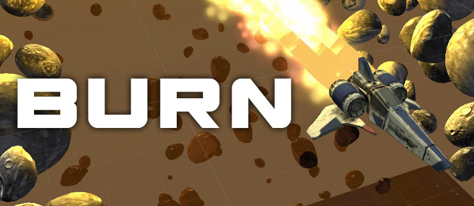
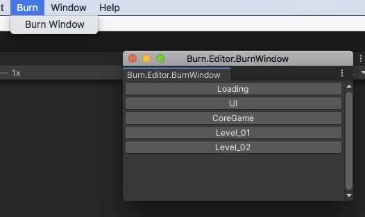
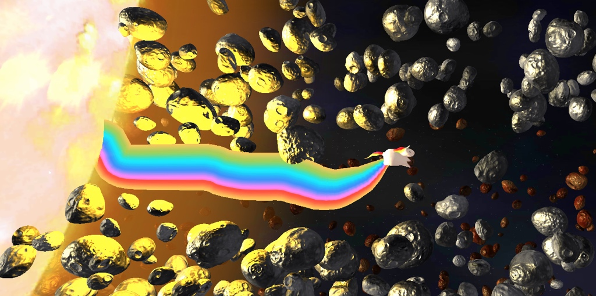
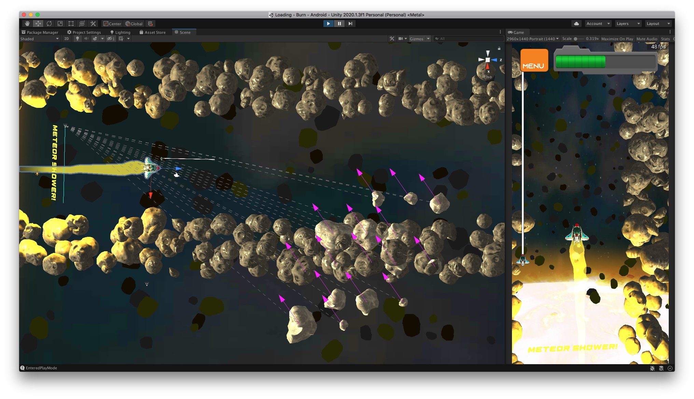
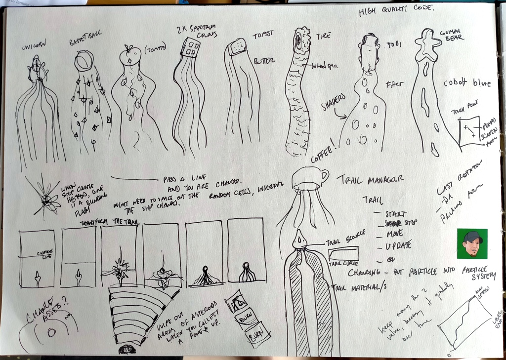
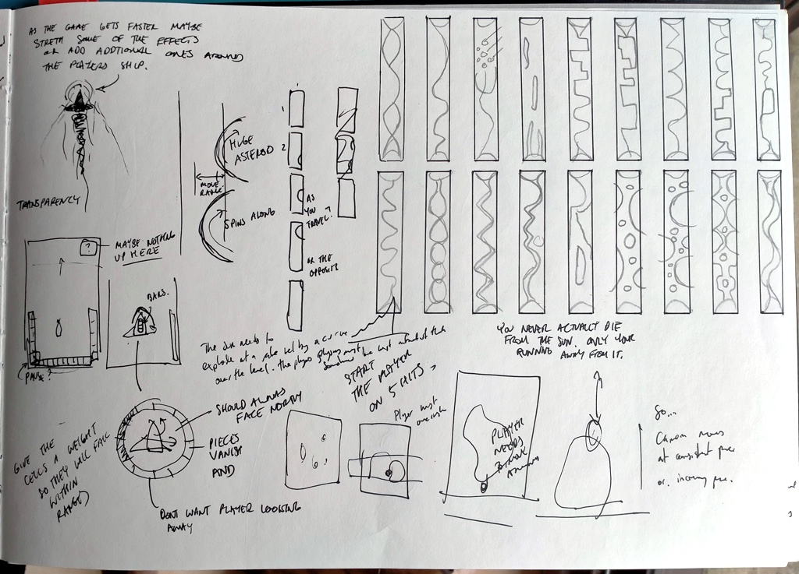
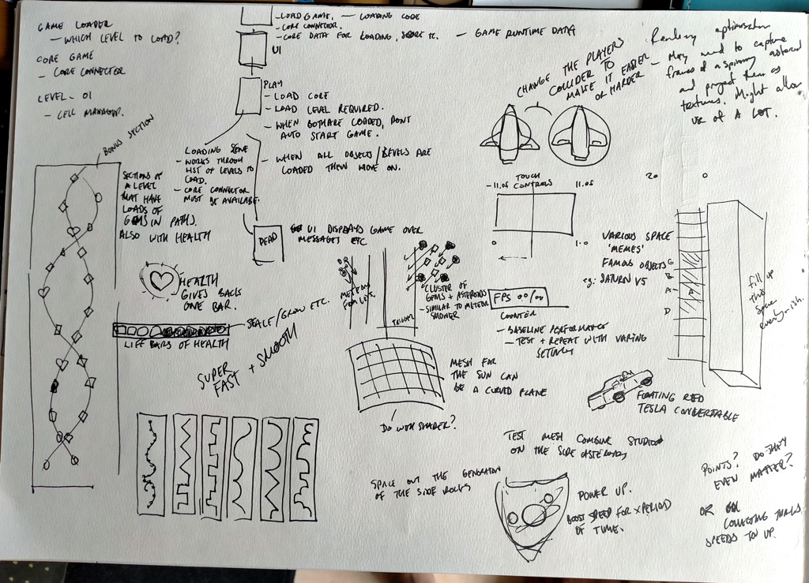

# Burn

 
    

Available to play in the Android google play store: <a href="https://play.google.com/store/apps/details?id=com.TerryPaton.Burn"> Burn </a>

The complete source to the mobile game 'Burn' developed in Unity, based on a concept from around 2011, by Terry Paton. Please feel free to contact me: <a href="mailto: terrypaton1@gmail.com"> terrypaton1@gmail.com </a>

## How?
Using Unity 2019.4+ open the project in the folder, 'Burn'. Press play. The game should intercept the play and load the games scenes. The game is setup that it requires the scene 'Loading' to be run first.
There is a tool for navigating to the games scenes. You can find this under the menu Burn > Burn Window

 
    

## Why?

The sun has gone super nova, vaporising most of the solar system. Steer your ship through the rubble and dangers to escape.

Essentially a very simple dodge and survive game. The primary focus is on clean optimised project and code with a finished published product.

The primary focus is as a portfolio piece. Often my paid work is NDA and I can't show anything when looking for new opportunities. So its a little sampling of what I can do, squeezed in after work and between life.
I am making this project open source as it feels like the right thing to do. Seth Laster generously donated his time making the 3D models for me, and he's allowing them to be available under this same license. So awesome. <a href="https://twitter.com/SethLaster"> twitter.com/SethLaster </a>

 
    

## Origin
Originally I had the idea for this game around 2011, to work as a collaboration project. That fizzled out, but this seemed the perfect game for me to develop into a small polished project. During the development of this version, the game changed a lot in order to limit scope, when ideas proved poor, or because it just wasn't fun. Lots changed and it was was fun changing it.

## Notes
- The game has been developed as an Android only game, simply because the game is free and open source and I'm not going to pay apple to share it for no profit.
- The game is a bit weird, intentionally. I wanted to have fun with this project so the idea of changing the ship into various things that have had influences on me added a bit of much needed 'spice'.
- The techniques used to develop this game are the result of years of experience in making things. I hope they can help you.
- There was no easy mode originally, the game was meant to be brutally hard. But, after my daughter, Pixel, play tested a few times for me it was apparent there had to be one. Thanks Pixel!

## Extras
There are a few development screenshots in /dev_screenshots/

 
    

And there's some sketchbook scribbles I made during the development of Burn too.

 
    
    
    

